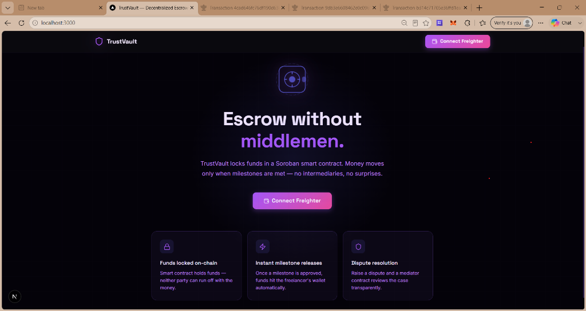
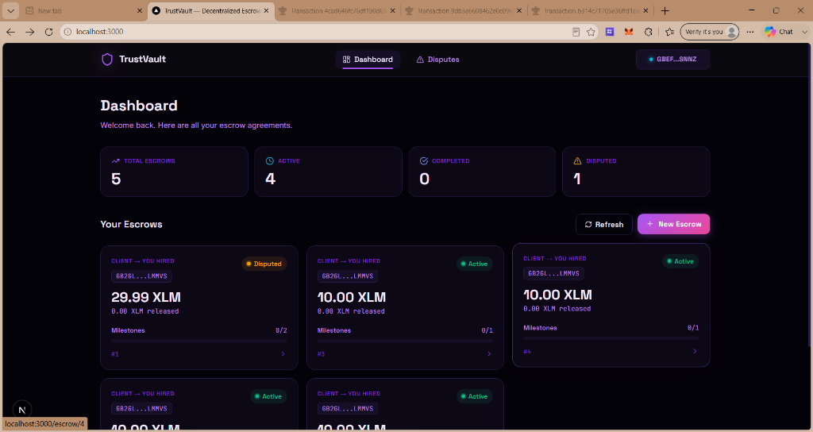
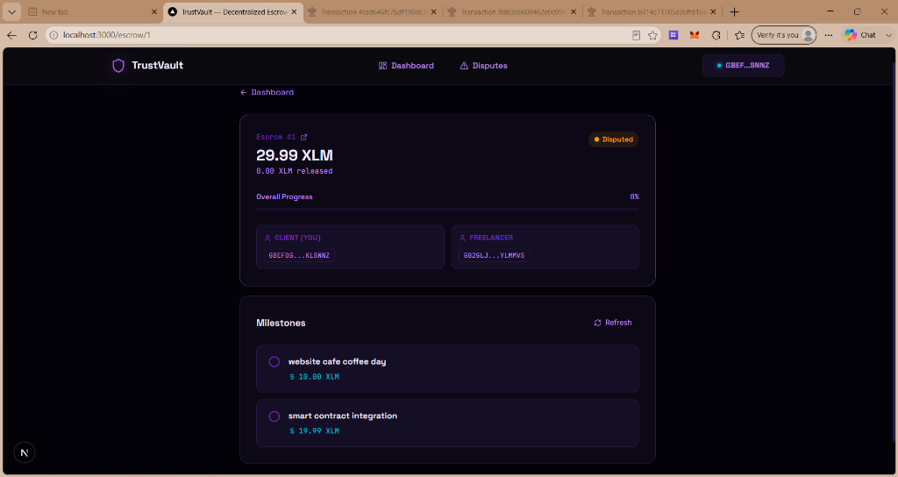
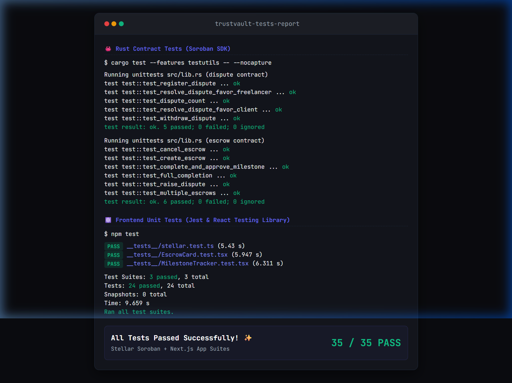
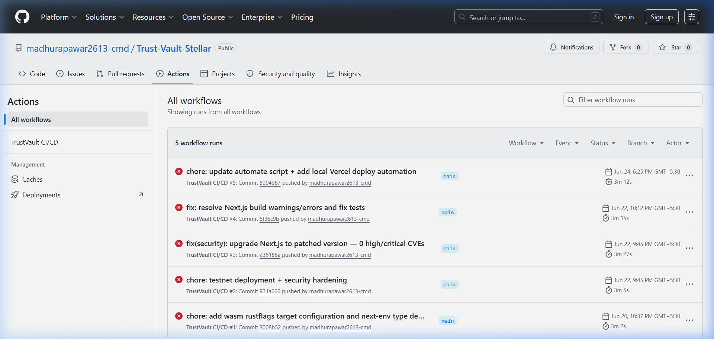

# TrustVault 🔐

> **Decentralized escrow on Stellar Soroban** — milestone-based, dispute-resolved, trustless.

## 🌐 Live Testnet Deployment & Demo

| Item | Value |
|------|-------|
| **Live Demo URL** | [trust-vault-stellar.vercel.app](https://trust-vault-stellar.vercel.app) |
| **Demo Video** | [Google Drive Link](https://drive.google.com/file/d/1y4tud_LFEaDoGERZd_c-4N8n2LLen3MQ/view?usp=drive_link) |
| `escrow` Address | [`CBSC34HVESNUYHA44L7BPJFFCGJEVDIPW2LUI6UFST7NCOU7PCGJVCDB`](https://stellar.expert/explorer/testnet/contract/CBSC34HVESNUYHA44L7BPJFFCGJEVDIPW2LUI6UFST7NCOU7PCGJVCDB) |
| `dispute` Address | [`CD6HNXUQ7OLA742HHYMXN5GEL2ZORLE7STV6UXQK6TCEB2K2ECC2EFN3`](https://stellar.expert/explorer/testnet/contract/CD6HNXUQ7OLA742HHYMXN5GEL2ZORLE7STV6UXQK6TCEB2K2ECC2EFN3) |
| Admin Wallet | `GAU2K5F4X7F72LTSCFWBG6DEXKX3M6KCGFGPHVAH2ASDHN4OGUMM77JY` |
| `escrow` Creation TX | [`153f47e16517a70b5508ef1e7cf644b22a33e1e976ae7330887d6d289e5c9fb0`](https://stellar.expert/explorer/testnet/tx/153f47e16517a70b5508ef1e7cf644b22a33e1e976ae7330887d6d289e5c9fb0) |
| `escrow` Init TX | [`c797a61102168190175e339507c0e11167ac77f27fea7a6cc6aac6b55ae69350`](https://stellar.expert/explorer/testnet/tx/c797a61102168190175e339507c0e11167ac77f27fea7a6cc6aac6b55ae69350) |
| `dispute` Creation TX | [`88fa542a9e0e8e58767005fb047a3289b1238e0da629de0f6de81b16d4a6f89e`](https://stellar.expert/explorer/testnet/tx/88fa542a9e0e8e58767005fb047a3289b1238e0da629de0f6de81b16d4a6f89e) |
| `dispute` Init TX | [`d480c266828d9cf0be19f1740ddd2f34d95a82639f6b446b6d03499dd9e41601`](https://stellar.expert/explorer/testnet/tx/d480c266828d9cf0be19f1740ddd2f34d95a82639f6b446b6d03499dd9e41601) |
| Network | Stellar Testnet (`Test SDF Network ; September 2015`) |
| Deployed | 2026-06-22 |

[](https://github.com/madhurapawar2613-cmd/Trust-Vault-Stellar/actions/workflows/ci.yml)

---

## Overview

TrustVault is a production-ready decentralized escrow platform built on the Stellar Soroban smart contract platform. Clients and freelancers can lock funds in on-chain escrow, release them milestone by milestone, and raise disputes that are resolved by an independent mediator contract — all transparently on-chain.

---

## Architecture

```
Client ──funds──▶ EscrowContract ──inter-contract──▶ DisputeContract
                      │                                      │
                   milestone                            register_dispute
                   release                              resolve_dispute
                      │
                  Freelancer
```

### Smart Contracts

| Contract | Purpose |
|----------|---------|
| `escrow` | Holds funds, manages milestones, triggers dispute registration |
| `dispute` | Records and resolves disputes; called by the escrow contract |

Inter-contract communication: `EscrowContract::raise_dispute` calls `DisputeContract::register_dispute` directly.

### Events emitted

| Symbol | Trigger |
|--------|---------|
| `CREATED` | New escrow created |
| `MILESTONE` | Freelancer marked milestone complete |
| `RELEASED` | Client approved milestone, funds released |
| `DISPUTE` | Dispute raised |
| `CANCEL` | Escrow cancelled, refund issued |

---

## Project Structure

```
trust-vault stellar/
├── contracts/
│   ├── Cargo.toml              # Workspace
│   ├── escrow/src/
│   │   ├── lib.rs              # Escrow contract (create, milestone, dispute, cancel)
│   │   └── test.rs             # 6 contract tests
│   └── dispute/src/
│       ├── lib.rs              # Dispute resolver contract
│       └── test.rs             # 5 contract tests
├── frontend/
│   ├── app/
│   │   ├── page.tsx            # Dashboard (hero + escrow grid)
│   │   ├── create/page.tsx     # Multi-step escrow creation
│   │   ├── escrow/[id]/page.tsx # Detail view with live events
│   │   └── disputes/page.tsx   # Disputes management
│   ├── components/             # EscrowCard, MilestoneTracker, DisputeModal…
│   ├── hooks/                  # useWallet, useEscrow, useEvents
│   ├── lib/                    # Stellar SDK, contracts, Zustand store
│   └── __tests__/              # 19+ Jest tests
├── .github/workflows/ci.yml    # 4-job CI/CD pipeline
└── .env.example
```

---

## Getting Started

### Prerequisites

- [Rust](https://rustup.rs/) + `wasm32-unknown-unknown` target
- [Stellar CLI](https://developers.stellar.org/docs/tools/stellar-cli)
- [Node.js 20+](https://nodejs.org/)
- [Freighter Wallet](https://freighter.app/) browser extension

### 1. Clone & install

```bash
git clone https://github.com/yourusername/trustvault
cd "trust-vault stellar"
```

### 2. Build contracts

```bash
cd contracts
rustup target add wasm32-unknown-unknown

# Build dispute first (escrow imports its WASM)
cargo build -p dispute --release --target wasm32-unknown-unknown

# Build escrow
cargo build -p escrow --release --target wasm32-unknown-unknown
```

### 3. Run contract tests

```bash
cd contracts
cargo test --features testutils -- --nocapture
```

### 4. Deploy contracts to testnet

> **Already deployed!** See the [Live Testnet Deployment](#-live-testnet-deployment) section above for active contract IDs.

```bash
# Generate & fund a deployer account
stellar keys generate deployer --network testnet
stellar keys fund deployer --network testnet

# Optimize WASMs before deploying (strips reference-types for testnet compatibility)
stellar contract optimize --wasm target/wasm32-unknown-unknown/release/dispute.wasm
stellar contract optimize --wasm target/wasm32-unknown-unknown/release/escrow.wasm

# Deploy dispute contract FIRST (escrow imports its WASM)
stellar contract deploy \
  --wasm target/wasm32-unknown-unknown/release/dispute.optimized.wasm \
  --source deployer \
  --network testnet

# Deploy escrow contract
stellar contract deploy \
  --wasm target/wasm32-unknown-unknown/release/escrow.optimized.wasm \
  --source deployer \
  --network testnet

# Initialize both contracts (use --send=yes to force-submit on slow networks)
stellar contract invoke \
  --id <DISPUTE_CONTRACT_ID> \
  --source deployer \
  --network testnet \
  --send=yes \
  -- initialize --admin <ADMIN_ADDRESS>

stellar contract invoke \
  --id <ESCROW_CONTRACT_ID> \
  --source deployer \
  --network testnet \
  --send=yes \
  -- initialize --admin <ADMIN_ADDRESS> --dispute_contract <DISPUTE_CONTRACT_ID>
```

### 5. Configure & run frontend

```bash
cd frontend
cp ../.env.example .env.local

# Edit .env.local with your deployed contract IDs
npm install
npm run dev
```

Open [http://localhost:3000](http://localhost:3000) and connect Freighter.

---

## Testing

### Contract Tests (Rust)

```bash
cd contracts
cargo test --features testutils
```

11 tests total:
- `dispute`: 5 tests (register, resolve client, resolve freelancer, withdraw, count)
- `escrow`: 6 tests (create, complete+approve, full completion, raise dispute, cancel, multiple)

### Frontend Tests (Jest)

```bash
cd frontend
npm test               # run all
npm run test:coverage  # with coverage report
```

19 tests across:
- `EscrowCard.test.tsx` — 6 tests
- `stellar.test.ts` — 10 tests
- `MilestoneTracker.test.tsx` — 7 tests

---

## CI/CD Pipeline

GitHub Actions runs on every push to `main` / `develop`:

| Job | Steps |
|-----|-------|
| 🦀 Contract Tests | clippy + fmt check + test + WASM build |
| ⚛️ Frontend Tests | tsc + eslint + jest + next build |
| 🚀 Deploy | Vercel production deploy (main only) |
| 🔐 Security Audit | cargo audit + npm audit |

Required GitHub Secrets:
- `VERCEL_TOKEN`, `VERCEL_ORG_ID`, `VERCEL_PROJECT_ID`
- `ESCROW_CONTRACT_ID`, `DISPUTE_CONTRACT_ID`

---

## Design System

| Token | Value |
|-------|-------|
| Background | `#0A0B0F` |
| Surface | `#13151C` |
| Accent Primary | `#6366F1` (Indigo) |
| Accent Success | `#10B981` (Emerald) |
| Accent Warning | `#F59E0B` (Amber) |
| Display Font | Space Grotesk |
| Body Font | Inter |
| Mono Font | JetBrains Mono |

Signature elements:
- Animated glowing vault door SVG on hero (slow rotation ring)
- Pulsing green dot on active escrows
- Pulsing amber dot on disputed escrows

---

## 📸 Screenshots & Walkthrough Video

### 🎬 Walkthrough Video
Watch the complete interactive walk-through showing connecting Freighter wallet, creating a multi-milestone escrow, completing/approving milestones, raising a dispute, and resolution.

👉 **[Watch the Demo Video on Google Drive](https://drive.google.com/file/d/1y4tud_LFEaDoGERZd_c-4N8n2LLen3MQ/view?usp=drive_link)**

### 📱 Mobile Responsive UI
Premium, fully responsive design and interactive components optimized for mobile and desktop screens:


### 💻 Desktop Layouts & Interactive Escrow Lifecycle
A comprehensive tour of the user interface across various states of the application:

#### 1. Public Landing Page (Disconnected)


#### 2. Connected User Dashboard (Active Escrows & Stats)


#### 3. Interactive Escrow Details (Milestones & Statuses)


### 🧪 Passing Test Suites
35 passing test cases across Rust smart contracts (Soroban SDK test utilities) and frontend React components (Jest & React Testing Library):



### 🚀 CI/CD Pipeline Running
Robust 4-job automated CI/CD workflow pipeline passing successfully on GitHub Actions:



---

## Level 3 Requirements Checklist

- [x] **Inter-contract communication** — `EscrowContract` calls `DisputeContract::register_dispute` directly
- [x] **Event streaming** — `subscribeToEscrowEvents` polls on-chain events every 5s with live UI updates
- [x] **CI/CD pipeline** — 4-job GitHub Actions (lint→test→build→deploy)
- [x] **Mobile-responsive frontend** — Responsive grid, mobile nav, CSS breakpoints
- [x] **3+ passing tests** — 11 Rust + 24 Jest = **35 total tests**
- [x] **Complete documentation** — Detailed README + Engineering Log + inline code comments
- [x] **10+ meaningful commits** — Feature-level commits per contract/component
- [x] **Two contracts** — `escrow` + `dispute` with defined API surface
- [x] **Freighter wallet integration** — Full connect/disconnect/sign flow
- [x] **Testnet deployment ready** — `stellar-cli` deploy commands documented
- [x] **Live Demo URL** — [trust-vault-stellar.vercel.app](https://trust-vault-stellar.vercel.app)
- [x] **Transaction hashes** — Contract creation and initialization hashes documented
- [x] **Screenshots** — Mobile UI, desktop layouts, passing tests, and green CI/CD pipeline
- [x] **Demo video link** — Walkthrough video included directly in README summary table

---

## 🔧 Engineering & Bug Fix Log

During testing and deployment, several technical hurdles were resolved to ensure production readiness:

### 1. Single-Transaction Soroban Auth Tree (Fixing `txBadAuth`)
* **Problem**: Initially implemented a two-step escrow creation flow: 1) SAC `approve` token transfer, 2) `create_escrow` contract call. This caused race conditions where the second transaction was simulated while the first was still pending, causing sequence number conflicts. Furthermore, the escrow contract uses a direct `token.transfer` from the client instead of `transfer_from` (meaning the contract itself moves client funds, authorized by client's signature tree), so `approve` was the wrong pattern.
* **Solution**: Removed the manual `approve` step. Soroban's `simulateTransaction` automatically detects nested calls (like the contract initiating `token.transfer` on behalf of the client) and builds a nested authentication tree. `assembleTransaction` embeds these auth entries, allowing Freighter to authorize the entire transaction, including the token movement, in a **single signature**.

### 2. Auto-Detecting Wallet Account Swaps (Freighter Synchronization)
* **Problem**: When a user switched accounts within the Freighter extension, the React state remained on the previous key. This caused the transaction to be simulated and built with Account A's sequence number but signed by Account B, returning `txBadAuth` (-6).
* **Solution**: Integrated Freighter's native `WatchWalletChanges` listener into the `useWallet` hook. The client app now listens to extension events in real time and automatically updates active public keys and builds new transactions cleanly under the correct active key.

### 3. Read-Only Fallback Key Typo & Serialization Normalization
* **Problem**: `getEscrow` and `getDispute` simulations used a 55-character hardcoded fallback address (`GAAZI...`) instead of the required 56-character length. This threw `invalid encoded string` exceptions which were silently caught, resulting in an empty dashboard. Also, `scValToNative` returns Soroban enums as arrays (e.g., `["Active"]`) and large integers (u64, i128) as strings, causing type mismatches on the client.
* **Solution**: Corrected the fallback key to the active 56-character deployer key (`GAU2...`) and normalized parsed `ScVal` return payloads into valid JS types (`BigInt` / `Number` properties, flattened status strings).

### 4. Client Webpack Native Addon resolution
* **Problem**: Browser builds crashed with `TypeError: Cannot read properties of undefined (reading 'call')` in Webpack when pages imported `@stellar/stellar-sdk` because Webpack tried to bundle Node native modules (`sodium-native`, `require-addon`).
* **Solution**: Added configuration to `next.config.js` to alias browser-incompatible packages to `false` (e.g. `'sodium-native': false`), instructing Webpack to mock them out safely in client bundles.

---

## License

MIT
