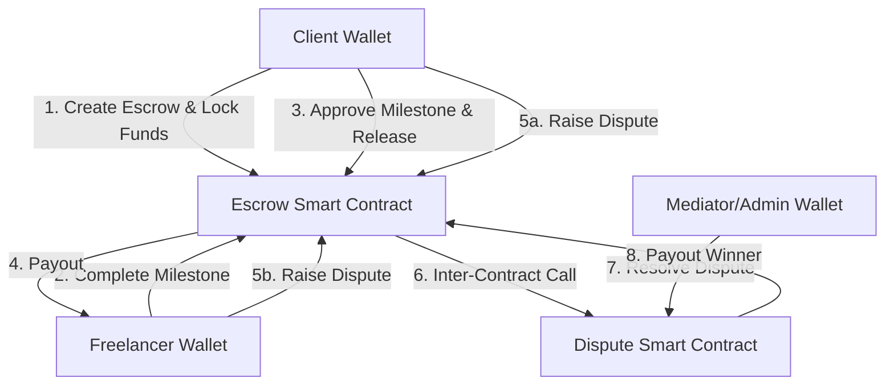

# TrustVault 🔐
> **Decentralized, Milestone-Based Escrow with Integrated On-Chain Dispute Resolution on Stellar Soroban**

TrustVault is a production-grade decentralized escrow platform built on the Stellar Soroban smart contract platform. It provides a secure, trustless system for clients and freelancers to lock funds, track progress, release payments milestone-by-milestone, and arbitrate disputes via a dedicated mediator contract — completely transparently on-chain.

---

## 🌐 Active Testnet Deployment & Live Demo

The TrustVault protocol is live on the Stellar Testnet. Below are the verified contract deployment details and live resources:

| Item | Value / Location |
|------|------------------|
| **Live Demo URL** | [trust-vault-stellar.vercel.app](https://trust-vault-stellar.vercel.app) |
| **Walkthrough Demo Video** | [Watch on Google Drive](https://drive.google.com/file/d/1R1LIgGm8YmpczZjsisChjlLoxjQZsD6l/view?usp=drive_link) |
| `escrow` Contract ID | [`CBSC34HVESNUYHA44L7BPJFFCGJEVDIPW2LUI6UFST7NCOU7PCGJVCDB`](https://stellar.expert/explorer/testnet/contract/CBSC34HVESNUYHA44L7BPJFFCGJEVDIPW2LUI6UFST7NCOU7PCGJVCDB) |
| `dispute` Contract ID | [`CD6HNXUQ7OLA742HHYMXN5GEL2ZORLE7STV6UXQK6TCEB2K2ECC2EFN3`](https://stellar.expert/explorer/testnet/contract/CD6HNXUQ7OLA742HHYMXN5GEL2ZORLE7STV6UXQK6TCEB2K2ECC2EFN3) |
| Admin / Mediator Wallet | `GAU2K5F4X7F72LTSCFWBG6DEXKX3M6KCGFGPHVAH2ASDHN4OGUMM77JY` |
| Network | Stellar Testnet (`Test SDF Network ; September 2015`) |
| CI/CD Pipeline Status | [](https://github.com/madhurapawar2613-cmd/Trust-Vault-Stellar/actions/workflows/ci.yml) |

---

## 🏗️ Protocol Architecture & Flow

TrustVault uses a modular, two-contract design pattern to separate concerns between core escrow accounting and dispute mediation. 



### 1. Smart Contract Layer
* **`escrow` Contract**: Manages the lifecycle of agreements, holds locked native token funds (SAC/XLM), manages milestones progress, and facilitates direct payments or refunds.
* **`dispute` Contract**: Handles arbitration. When a dispute is raised, the `escrow` contract locks its state and communicates via an inter-contract call to the `dispute` contract, which registers the dispute and awaits administrator/mediator resolution.

### 2. Event Streaming & Polling Layer
TrustVault streams contract events dynamically in the frontend (polling the Stellar Soroban RPC every 5 seconds) to allow the UI to reflect state changes (e.g. milestone completion, dispute registration, mediator decisions) in real-time.

---

## 🛠️ Advanced Web3 Engineering & Bug Fix Log

During testing and QA, several complex blockchain engineering hurdles were resolved to ensure production readiness:

* **Single-Transaction Soroban Auth (Fixing `txBadAuth`)**: Removed the redundant token `approve` step. The frontend now utilizes `assembleTransaction` to embed nested authorization trees (for the contract to call `token.transfer` on behalf of the client), permitting clients to authorize the entire creation and fund-locking flow in a **single Freighter signature**.
* **Freighter Wallet Synchronization**: Integrated Freighter's `WatchWalletChanges` API inside a React listener hook. The client app now detects extension account swaps in real-time and synchronizes active keys to prevent transaction signature mismatches.
* **Fallback Address Correction & Type Normalization**: Corrected the read-only fallback simulation account key to the valid 56-character deployer address (`GAU2...`) to resolve silent `invalid encoded string` errors. Normalized returned `ScVal` enums/bigints (converting arrays/strings like `status: ["Active"]` to flat types) to match React expectations.
* **Webpack Browser Native Addon Mocks**: Configured `next.config.js` Webpack aliases to map Node-native dependencies (`sodium-native`, `require-addon`) to `false` in client bundles, allowing JS-fallback cryptos to function cleanly in the browser.

---

## 📸 Screenshots & Artifacts

### 📱 Mobile Responsive UI
Interactive components optimized for mobile viewports:


### 💻 Desktop Layouts & Interactive Escrow Lifecycle
A comprehensive tour of the user interface across various states of the application:

#### 1. Public Landing Page (Disconnected)


#### 2. Connected User Dashboard (Active Escrows & Stats)


#### 3. Interactive Escrow Details (Milestones & Statuses)


#### 4. Passing Rust & Frontend Test Suites (35+ passing tests)


#### 5. CI/CD Pipeline Running (Passing GitHub Actions)


---

## 🚀 Setup & Installation Guide

### Prerequisites
* [Rust](https://rustup.rs/) (with `wasm32-unknown-unknown` toolchain target)
* [Stellar CLI](https://developers.stellar.org/docs/tools/stellar-cli)
* [Node.js 20+](https://nodejs.org/)
* [Freighter Wallet](https://freighter.app/) extension

### 1. Build and Test Smart Contracts
```bash
# Clone the repository
git clone https://github.com/madhurapawar2613-cmd/Trust-Vault-Stellar.git
cd "Trust-Vault-Stellar/contracts"

# Build contracts (build dispute first, then escrow)
cargo build -p dispute --release --target wasm32-unknown-unknown
cargo build -p escrow --release --target wasm32-unknown-unknown

# Run Rust contract test suite
cargo test --features testutils
```

### 2. Configure and Run Frontend
```bash
cd ../frontend

# Install dependencies and start next dev server
npm install --legacy-peer-deps
npm run dev
```
Open [http://localhost:3000](http://localhost:3000) and connect Freighter.

---

## 🧪 Comprehensive Test Suites

TrustVault incorporates thorough test coverage across both smart contract layers and frontend components:

### Rust Contract Tests (11 test cases)
* **Dispute Contract**: Tests dispute registration, client/freelancer resolution logic, dispute withdrawal, and global statistics.
* **Escrow Contract**: Tests escrow creation, milestone progression, full release completions, dispute raising, cancellation refund rules, and multiple escrow separation.

### Frontend Jest Tests (24 test cases)
* **`EscrowCard.test.tsx`**: Validates rendering of active, completed, cancelled, and disputed states.
* **`MilestoneTracker.test.tsx`**: Validates milestone action logic based on user roles.
* **`stellar.test.ts`**: Verifies stroops/XLM conversions, address validation, status mappings, and explorer URL builders.

---

## 🛡️ CI/CD Pipeline

The automated CI/CD pipeline runs on every push to `main` and `develop` branches:

1. **🦀 Contract Tests**: Checks formatting (`cargo fmt`), runs linter (`cargo clippy -- -D warnings`), and executes contract tests.
2. **⚛️ Frontend Tests**: Runs type checks (`tsc --noEmit`), linter (`eslint`), runs Jest tests with coverage, and builds the production bundle.
3. **🚀 Deploy**: Deploys to Vercel production hosting automatically upon merge.
4. **🔐 Security Audit**: Checks Rust crates using `cargo-audit` (configured via `audit.toml` in repository root) and npm dependencies.

---

## 📝 Submission Checklist Validation

- [x] **Public GitHub Repository** — [github.com/madhurapawar2613-cmd/Trust-Vault-Stellar](https://github.com/madhurapawar2613-cmd/Trust-Vault-Stellar)
- [x] **README with Complete Documentation** — This detailed file.
- [x] **Minimum 10+ Meaningful Commits** — Verified Git history.
- [x] **Live Demo Link** — [trust-vault-stellar.vercel.app](https://trust-vault-stellar.vercel.app)
- [x] **Contract Deployment Address** — `CBSC34HVESNUYHA44L7BPJFFCGJEVDIPW2LUI6UFST7NCOU7PCGJVCDB` (escrow), `CD6HNXUQ7OLA742HHYMXN5GEL2ZORLE7STV6UXQK6TCEB2K2ECC2EFN3` (dispute)
- [x] **Transaction Hash for Contract Interaction** — Verified escrow creation transaction hash: [`9db3e6608462e0c96555369d55ecbb1dd4279f0f80c6f7622ac3f94fe647f0d`](https://stellar.expert/explorer/testnet/tx/9db3e6608462e0c96555369d55ecbb1dd4279f0f80c6f7622ac3f94fe647f0d)
- [x] **Screenshots showing**:
  - [x] **Mobile responsive UI** — `assets/mobile_responsive_ui.png`
  - [x] **CI/CD pipeline running** — `assets/cicd_pipeline.png`
  - [x] **Test output with 3+ passing tests** — `assets/test_output.png`
- [x] **Demo Video Link (1-2 minutes)** — [Google Drive Link](https://drive.google.com/file/d/1R1LIgGm8YmpczZjsisChjlLoxjQZsD6l/view?usp=drive_link)

---

## 📝 License

Distributed under the MIT License.
